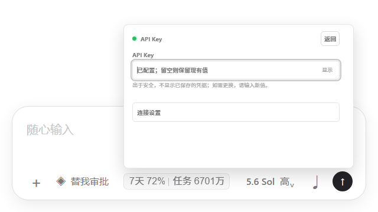

# Codex Usage Monitor for Windows

> In-app usage monitor and status bar for OpenAI Codex Desktop on Windows

[](https://github.com/JiaYang-BUAA/Codex-Desktop-Usage-Monitor-Windows/actions/workflows/ci.yml)
[](https://github.com/JiaYang-BUAA/Codex-Desktop-Usage-Monitor-Windows/releases/latest)

直接在 Windows 版 Codex Desktop 输入区域旁查看官方订阅周期、任务 Token、API 账户和 API Key 用量。监视器通过仅绑定本机的 Chrome DevTools Protocol（CDP）运行时注入，不是独立悬浮窗，也不修改 WindowsApps、`app.asar`、Codex 登录文件或模型配置。

> 本项目是非官方项目，与 OpenAI 没有隶属、赞助或背书关系。Codex 更新可能改变页面结构；项目会持续通过兼容性测试适配新版界面。

**v2.1.0 更新：**API 账户和 API Key 可直接在展开面板安全配置；API Key 使用面向小白的渐进式表单。显示项和四个界面开关改由监视器后台持久化，Codex 重启或更新后仍能恢复上次选择；全新设置默认仅显示“7天剩余”和“当前任务累计 Token”。


- 同一面板支持官方订阅、API 账户和 API Key 三种数据源。
- 自动适配新版与旧版 Codex Composer 布局。
- 凭据使用当前 Windows 用户的 DPAPI 加密保存，不进入源码、页面设置或日志。
- 安装器会创建独立的 `Codex Usage Monitor` 桌面快捷方式，一次启动 Codex 与监视器。
- 支持中文与 English UI、极简模式、倒计时可视化和可选的版本更新提醒。

## 1. 三步开始使用

### 1.1 准备环境

- Windows 10/11。
- 已安装并能正常登录的 Codex Desktop。
- Node.js 22 或更高版本。
- 推荐使用 PowerShell 7，并确认可以运行 `pwsh`。
- 安全软件：项目使用隐藏 PowerShell、Node.js 后台进程和 CDP 参数，可能触发安全软件的启发式误报。确认安装包来自本仓库后，为项目目录、启动脚本或相关进程添加精确信任规则，或者直接关闭杀毒软件。

### 1.2 下载并安装

1. 从 [最新 Release](https://github.com/JiaYang-BUAA/Codex-Desktop-Usage-Monitor-Windows/releases/latest) 下载 `codex-usage-monitor-windows-*.zip`。
2. 解压后在目录中运行：

   ```powershell
   pwsh -NoProfile -File .\install.ps1
   ```

3. 正常退出已经打开的 Codex，然后双击桌面的 `Codex Usage Monitor` 快捷方式。

原生 Codex 图标不会自动开放本机 CDP 端口，因此不会注入监视器。专用快捷方式会同时启动 Codex 和监视器，并隐藏正常的黑色命令行窗口。

### 1.3 让 Codex 帮你安装

不熟悉 PowerShell 时，可以把下面这段话直接发送给 Windows 版 Codex：

```text
请安装这个项目：https://github.com/JiaYang-BUAA/Codex-Desktop-Usage-Monitor-Windows
先阅读仓库根目录的 AGENTS.md 和 README.md，再运行 install.ps1。自动寻找 Microsoft Store 和常见非 Store Codex 路径；找不到时才询问我选择真实的 ChatGPT.exe 或 codex.exe。不要猜路径，不要修改 WindowsApps、app.asar、Codex 登录文件或模型配置，也不要强制终止或重启我当前的 Codex。安装后验证桌面的“Codex Usage Monitor”快捷方式。
官方订阅无需配置。API 账户和 API Key 请优先指导我在监视栏展开面板中填写；密钥不能粘贴到聊天、源码、JSON 或日志。找不到服务商字段时，请根据公开文档或脱敏截图解释，不要猜测接口。
```

## 2. 界面与默认设置

### 普通模式

全新设置默认只显示“7天剩余”和“当前任务累计 Token”。普通模式最多选择 8 项。


### 极简模式

极简模式隐藏指标名称，仅保留数值与单位，最多选择 14 项；选中 9 项及以上时自动使用双行压缩布局。


### 展开面板

点击监视栏可展开三栏面板。每项前的复选框决定是否显示在折叠栏中；“官方订阅”下方的“本次任务相关”分区显示当前任务累计 Token 和上次对话消耗 Token。

API 账户和 API Key 标题后各有一个“配置”按钮。API Key 已有连接配置时只需填写或更换 Key，复杂连接字段默认折叠。



显示项、极简模式、倒计时可视化、English UI 和版本更新提醒由监视器后台保存到 `%LOCALAPPDATA%\CodexUsageMonitor\ui-settings.json`。设置文件不包含账号凭据，Codex 重启、更新或页面存储被重建后仍能恢复。

## 3. 配置数据源

| 数据源 | 作用 | 需要准备 |
| --- | --- | --- |
| 官方订阅 | 显示 5 小时/7 天周期、重置时间和官方订阅 Token 汇总。 | 无需额外凭据。 |
| API 账户 | 显示第三方账户余额、累计额度、请求日志和 Token 账本。 | Base URL、数字用户 ID、账户访问令牌、累计 Token 基准。 |
| API Key | 显示某个 API Key 的额度、限额、到期时间和请求状态。 | API Key；首次配置时还需服务地址和用量接口路径。 |

### 3.1 官方订阅

启动后自动读取 Codex Desktop 本机 app-server，无需额外填写凭据。红色指示灯表示本轮请求失败但仍保留上一次成功数据，不代表额度耗尽或模型不可用。

### 3.2 API 账户

展开面板，点击“API 账户”后的“配置”，填写：

- API 服务 Base URL。
- 数字用户 ID。
- 账户访问令牌（Access Token）。
- 当前真实的累计 Token 基准；不知道精确值时填 `0`。

保存前会验证账户接口并读取当前日志建立检查点，成功后使用 DPAPI 加密保存访问令牌。账户访问令牌不一定等于 API Key。

### 3.3 API Key

展开面板，点击“API Key”后的“配置”：

- 已有连接配置时，通常只需填写或更换 API Key。
- 首次配置时，填写 API Key、API 服务地址和用量接口路径。
- 认证头和响应字段映射位于“高级设置（通常无需修改）”。
- 密钥框不会回填；已经配置时留空可保留原密钥。

部分服务商会限制用量查询接口频率。界面显示“请求受限”表示服务商返回 `HTTP 429`，不一定代表 Key 失效。监视器会保留旧数据，并按 60、120、240、300 秒逐步退避；恢复成功后回到 60 秒刷新。

指标来源、Token 口径、状态灯和 Provider 映射详见 [数据源与指标说明](docs/data-sources.md)。

## 4. 安装与高级配置

### 4.1 Windows 运行包

安装器把白名单运行文件复制到 `%LOCALAPPDATA%\Programs\CodexUsageMonitor\<版本号>`，并创建桌面快捷方式。运行包不包含 Node.js、Codex、API Key、用户日志或本地 Provider 配置。

### 4.2 从源码安装

```powershell
git clone https://github.com/JiaYang-BUAA/Codex-Desktop-Usage-Monitor-Windows.git
cd Codex-Desktop-Usage-Monitor-Windows
pwsh -NoProfile -File .\install.ps1
```

安装器会优先自动寻找 Microsoft Store 和常见非 Store 路径；找不到时才询问实际文件。也可以提前设置真实路径：

```powershell
[Environment]::SetEnvironmentVariable('CODEX_USAGE_DESKTOP_PATH', 'D:\Apps\Codex\ChatGPT.exe', 'User')
[Environment]::SetEnvironmentVariable('CODEX_USAGE_CODEX_PATH', 'D:\Apps\Codex\codex.exe', 'User')
[Environment]::SetEnvironmentVariable('CODEX_USAGE_NODE_PATH', 'D:\Runtime\node.exe', 'User')
```

### 4.3 命令行兼容入口

面板配置是推荐方式。以下命令保留给自动化和高级用户：

```powershell
pwsh -NoProfile -File .\scripts\configure-api-account.ps1 -FromClipboard -UserId <用户ID> -BaseUrl https://api.example.com
pwsh -NoProfile -File .\scripts\configure-token-baseline.ps1 -InitialTokens <完整整数>

Copy-Item .\config\providers\custom.example.json .\config\providers\my-provider.local.json
pwsh -NoProfile -File .\scripts\configure-api-provider.ps1 -ConfigPath .\config\providers\my-provider.local.json -FromClipboard
```

清除配置：

```powershell
pwsh -NoProfile -File .\scripts\clear-api-provider.ps1
pwsh -NoProfile -File .\scripts\clear-api-account.ps1
pwsh -NoProfile -File .\scripts\clear-token-baseline.ps1
```

## 5. 安全与隐私

- CDP 仅绑定 `127.0.0.1`，不会向局域网或互联网开放调试端口。
- 携带凭据的远程 API 请求强制使用 HTTPS；只有本机回环地址允许 HTTP。
- 远程请求拒绝重定向，并限制单个 JSON 响应体最大为 2 MiB。
- API Key 和账户访问令牌使用当前 Windows 用户 DPAPI 加密，换用户、换电脑或删除本地状态后需要重新配置。
- 明文凭据只在当前表单和本机配置进程内存中短暂存在；项目不读取 `%USERPROFILE%\.codex\auth.json` 或 `config.toml`。
- 项目不会修改 WindowsApps、`app.asar`、Codex 登录文件或模型配置，也不会强制结束正在运行的 Codex。

完整安装、配置与安全契约见 [AGENTS.md](AGENTS.md)。

## 6. 常见问题与排查

1. **点击快捷方式没有反应**：确认 Codex 已正常退出，检查 `node -v` 是否为 22+，然后重新运行 `install.ps1`。
2. **Codex 启动但没有监视栏**：必须使用 `Codex Usage Monitor` 快捷方式并等待最多 30 秒。实际 CDP 端口记录在 `%LOCALAPPDATA%\CodexUsageMonitor\state.json`。
3. **官方订阅指示灯变红**：表示当前请求失败但仍有缓存数据，不代表额度耗尽。等待后台自动刷新即可。
4. **API Key 显示请求受限**：等待 60～300 秒自动退避，避免反复重启或重复保存配置。
5. **API 账户失败**：确认用户 ID 是数字、令牌是完整单行文本且接口返回 JSON；不要把令牌或私有响应发到聊天。
6. **安全软件拦截**：项目没有编译 EXE、自启动服务或下载器，但隐藏 PowerShell、Node 后台进程和 CDP 参数可能触发启发式检测。添加相关行为放行，或直接关闭杀毒软件。

完整诊断命令、日志位置和恢复步骤见 [故障排查指南](docs/troubleshooting.md)。

## 7. 开发与测试

```powershell
pwsh -NoProfile -File .\scripts\start-monitor.ps1
pwsh -NoProfile -File .\scripts\restore-monitor.ps1
node .\scripts\validate-provider.mjs .\config\providers\custom.example.json
npm ci
pwsh -NoProfile -File .\tests\run-tests.ps1
pwsh -NoProfile -File .\scripts\build-release.ps1
```

测试覆盖 JavaScript/PowerShell 语法、官方周期、Token 单位、账户分页与累计基线、通用 Provider 映射、恶意配置拒绝、DPAPI 持久化、UI 生命周期、设置恢复、启动器、安全扫描和运行包白名单。Windows CI 会在推送和 Pull Request 时运行同一套测试。

## 8. 常见问题 / FAQ

### 监视器是独立悬浮窗吗？

不是。它直接插入 Codex Desktop 输入区域，会随 Codex 页面一起显示和隐藏。

### 为什么必须使用专用快捷方式？

监视器需要 Codex 启动时开放仅绑定本机的 CDP 端口。原生图标不会开放该端口，因此无法注入。

### 是否支持 Microsoft Store 和非 Store 版本？

支持。安装器会自动寻找两类路径，找不到时才询问真实的 `ChatGPT.exe` 或 `codex.exe`。

### 官方订阅、API 账户和 API Key 有什么区别？

官方订阅读取 Codex 本机账户与任务事件；API 账户读取第三方用户账户和请求日志；API Key 读取某个密钥对应的额度接口。后两者由不同凭据和接口驱动。

## 9. 项目与贡献者

项目从 [Fei-Away/Codex-Dream-Skin](https://github.com/Fei-Away/Codex-Dream-Skin) 的运行时注入思路演化而来，当前发布版只保留用量监视功能。代码采用 MIT License，详见 [LICENSE](LICENSE) 与 [NOTICE.md](NOTICE.md)。

- [+羊（@JiaYang-BUAA）](https://github.com/JiaYang-BUAA)：项目发起、产品设计与维护。
- [Codex（@codex）](https://github.com/codex)：协作完成界面设计、功能实现、问题诊断、测试与文档。
