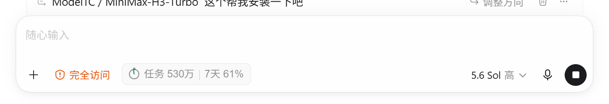
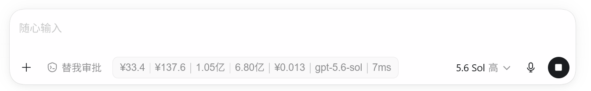
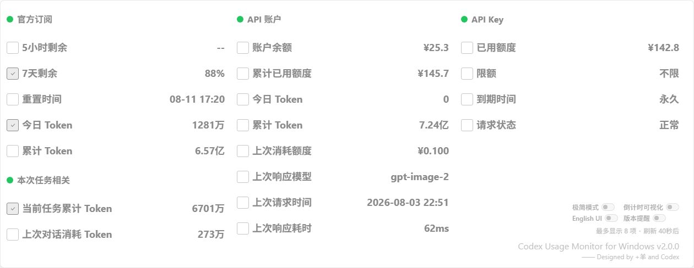

# Codex Usage Monitor for Windows

> In-app usage monitor and status bar for OpenAI Codex Desktop on Windows

[](https://github.com/JiaYang-BUAA/Codex-Desktop-Usage-Monitor-Windows/actions/workflows/ci.yml)
[](https://github.com/JiaYang-BUAA/Codex-Desktop-Usage-Monitor-Windows/releases/latest)

Track official subscription quota and reset time, task token usage, API account usage, and API key limits directly beside the Codex composer through local Chrome DevTools Protocol (CDP) runtime injection. It is not a floating overlay and does not patch `app.asar` or modify WindowsApps.

这是一个直接显示在 Windows 版 OpenAI Codex Desktop 输入区域内的用量监视栏。它通过仅绑定本机的 CDP 运行时注入，在 Codex 输入栏旁显示官方订阅周期余量与重置时间、任务 Token、API 账户和 API Key 用量。它不是桌面悬浮窗，也不修改 WindowsApps、`app.asar`、Codex 登录文件或模型配置。

**v2.0.0 更新：**将界面常量、中英文文案、Codex DOM 定位和版本检查拆成独立模块；新增布局策略与失败原因自检、中文/English UI 切换和可选的 GitHub 版本提醒。本机任务日志保持增量读取，并在活跃与空闲状态间自动切换扫描频率；页面隐藏时暂停布局与倒计时刷新。v2.0.0 同时移除了旧版 Dream Skin 运行时兼容代码，保留从 v1 设置到 v2 设置的一次性迁移。

- 直接注入 Codex Desktop 渲染页面，不是独立悬浮窗。
- 同一面板支持官方订阅、API 账户和 API Key 三种数据源。
- 自动寻找 Microsoft Store 和常见非 Store Codex 安装路径。
- 使用本机 CDP 运行时注入，不修改 Codex 安装文件；凭据使用 Windows DPAPI 持久化保护。
- 安装器会创建独立的 `Codex Usage Monitor` 桌面快捷方式，一次启动 Codex 与监视器。
- 官方订阅模式无需额外填写凭据。
- 支持中文与 English UI；版本提醒默认关闭，开启后最多每 24 小时向 GitHub Releases API 发起一次无凭据请求，只显示可用版本链接，不会自动下载或执行文件。

监视栏位于“替我审批”右侧。普通模式最多显示 8 项数据，极简模式最多显示 14 项。

**普通模式**



**极简模式**



点击监视栏后可同时查看官方订阅、API 账户和 API Key 三类数据；官方订阅下方另设“本次任务相关”分区。

**展开面板**



## 1. 简要安装说明

### 1.1 安装前准备

- 基础环境：Windows 10/11、已安装并能正常登录的 Codex Desktop，以及 Node.js 22 或更高版本。建议安装或更新 PowerShell 7，并确认可以运行 `pwsh`。
- 官方订阅：无需额外准备凭据，监视器会从 Codex Desktop 本机读取官方账户用量。
- API 账户：如需启用，请准备服务商的 Base URL、数字用户 ID 和账户访问令牌。Base URL 一般在“API 文档”“开发者文档”中；远程服务必须使用 HTTPS，只有 `localhost`、`127.0.0.1` 和 `::1` 等本机回环地址允许 HTTP。用户 ID 一般在“用户资料”“账户信息”“个人中心”中；访问令牌一般在“用户资料”“安全设置”“Access Token”“用户令牌”中。不同服务商名称可能不同，账户访问令牌也不一定等于 API Key。
- API Key：如需启用，请准备 API 密钥；一般在服务商的“开发者控制台”“API Keys”“密钥管理”“令牌管理”中创建或查看。用量查询地址和返回字段通常在“用量”“额度”“账单”或 API 文档中，建议同时准备相关接口文档，交给 Codex 自动适配。
- 安全软件：项目使用隐藏 PowerShell、Node.js 后台进程和 CDP 参数，可能触发安全软件的启发式误报。确认安装包来自本仓库后，为项目目录、启动脚本或相关进程添加精确信任规则，或者直接关闭杀毒软件。

### 1.2 让 Codex 帮你安装（推荐）

把下面的文字发给 Windows 版 Codex：

```text
请安装这个项目：https://github.com/JiaYang-BUAA/Codex-Desktop-Usage-Monitor-Windows
先阅读仓库根目录的 AGENTS.md 和 README.md。运行 install.ps1，自动寻找 Microsoft Store 和常见非 Store Codex 路径；找不到时才询问我选择真实的 ChatGPT.exe 或 codex.exe。不要猜路径，不要修改 WindowsApps、app.asar、Codex 登录文件或模型配置，不要终止或重启我当前的 Codex。安装后验证桌面上的“Codex Usage Monitor”快捷方式。
然后询问我需要启用官方订阅、API 账户、API Key 中的哪些数据源。询问每项配置时，同时告诉我一般在哪里找到：Base URL 通常在服务商的 API 或开发者文档；数字用户 ID 通常在用户资料、账户信息或个人中心；API 账户访问令牌通常在用户资料、安全设置、Access Token 或用户令牌页面；API Key 通常在开发者控制台、API Keys、密钥管理或令牌管理页面；累计 Token 通常在用量统计、账单、消费记录或 Token 统计页面。名称因服务商而异，账户访问令牌不一定等于 API Key；找不到时询问服务商名称并让我提供公开文档或脱敏截图，不要猜。API 账户和 API Key 的密钥只能让我复制到 Windows 剪贴板后由脚本读取，不能让我粘贴到聊天、源码、JSON 或日志。询问 API 账户的累计 Token 初始值；这是当前真实的完整整数，如果我不知道就使用 0 并说明之后会按可见日志累加。若我的接口返回字段和示例不同，请先检查脱敏后的响应结构，自动调整本地字段映射或归一化代码，增加测试并运行完整测试，不要把我的密钥或私有响应写入仓库。
```

安装完成后，先正常退出已经打开的 Codex，再双击桌面快捷方式 `Codex Usage Monitor`。原生 Codex 图标不会自动开放本机 CDP 端口，因此不会注入监视器。快捷方式会同时启动 Codex 和监视器，不显示正常的黑色命令行窗口。

### 1.3 选择数据源并配置

> **如果不懂如何运行下面的命令，请直接让 Codex 按本教程帮你完成安装和配置，无需自己手动操作。**

- 官方订阅：周期和账户汇总来自 Codex Desktop 本机 app-server；“今日 Token”读取本机任务的 `token_count` 事件，并把确认使用当前 ChatGPT 官方认证的每回合 `total_token_usage` 正增量直接累加。“累计 Token”以最近一次官方值为基准，在官方值不变时叠加此后本机产生的官方订阅 Token；官方完整整数一旦变化，立即清空本机临时增量并直接采用新官方值。API、API Key 和无法确认来源的回合不计入。无需配置，启动后自动读取。
- API 账户：数据来自第三方服务商的账户信息与请求日志接口。准备服务商的接口文档、账户访问令牌和数字用户 ID。Base URL 通常在“API 文档”或“开发者文档”；用户 ID 通常在“用户资料”“账户信息”或“个人中心”；访问令牌通常在“用户资料”“安全设置”“Access Token”或“用户令牌”页面。访问令牌不一定等于 API Key。先让 Codex 按接口文档确认或适配请求路径与返回字段，再复制令牌并运行：

  ```powershell
  pwsh -NoProfile -File .\scripts\configure-api-account.ps1 -FromClipboard -UserId <你的用户ID> -BaseUrl https://api.example.com
  ```

- API Key：数据来自服务商针对 API key 提供的额度或用量查询接口。API Key 通常在“开发者控制台”“API Keys”“密钥管理”或“令牌管理”页面创建；查询接口一般记录在“用量”“额度”“账单”或 API 文档中。把服务商的接口文档交给 Codex，让它根据通用模板填写请求地址、认证头和返回字段映射。确认配置后复制 API key，再从剪贴板安全保存；不要把 key 写进聊天或 JSON：

  ```powershell
  Copy-Item .\config\providers\custom.example.json .\config\providers\my-provider.local.json
  pwsh -NoProfile -File .\scripts\configure-api-provider.ps1 -ConfigPath .\config\providers\my-provider.local.json -FromClipboard
  ```

> **API Key 请求受限提醒：**部分服务商会限制用量查询接口的调用频率。界面显示“请求受限”表示服务商返回了 `HTTP 429`，不一定代表 API key 失效或模型请求不可用。监视器会保留上一次成功数据，并按 60、120、240、300 秒逐步延长重试间隔；恢复成功后回到 60 秒刷新。请等待自动重试，不要反复重启 Codex 或重复运行配置命令，否则可能延长限流时间。

API 账户配置后，输入当前真实累计 Token（完整整数，不要写“5亿”）。该数值通常可在服务商的“用量统计”“账单”“消费记录”或“Token 统计”页面找到；如果页面只显示取整后的“万/亿”，应打开详情或导出记录，不要自行猜测精确整数：

```powershell
pwsh -NoProfile -File .\scripts\configure-token-baseline.ps1 -InitialTokens <完整整数>
```

如果不设置，默认按 `0` 开始。设置初始值是因为第三方日志接口通常只返回有限页数，监视器会记住初始值，并把之后发现的新请求 Token 累加到本地。程序优先使用服务商提供的稳定请求 ID；没有稳定 ID 时，使用请求时间、Token、额度、模型和耗时生成指纹。累计与今日 Token 使用单调追加账本，不会因为页内序号被复用而回退。同一个状态文件还会按本机日期持久化“今日 Token”，Codex 或 Windows 重启后不会清空，第二天自动归零。该状态只保存在 `%LOCALAPPDATA%\CodexUsageMonitor\account-token-counter.json`，不会进入仓库。

从 `1.7.0` 或更早版本升级后，请重新执行一次上面的基准配置命令。旧版曾把部分服务商的页内 `id` 误当成请求 ID，旧账本可能已经产生正负偏差，程序无法在不知道网站真实累计值的情况下自动还原。

### 1.4 展开监视栏查看和勾选

点击监视栏即可展开三栏面板。左侧“官方订阅”下方另设“本次任务相关”分区，集中显示当前任务累计 Token 和上次对话消耗 Token。每项前的复选框决定是否显示在折叠后的监视栏中，最多显示 8 项；三栏网络数据共用 60 秒刷新周期。本机 Token 日志采用增量读取：检测到任务活动后的短时间内约每 2 秒检查一次，空闲后约每 12 秒检查一次。请求失败时保留上一次成功数据；有缓存时指示灯变为红色，没有可用数据时显示灰色。

面板右下角、“Codex Usage Monitor for Windows v2.0.0”标识上方提供四个显示开关以及“最多显示 · 刷新”提示：开启“极简模式”后，折叠监视栏只显示数值与单位，不显示数据项名称，可最多选择 14 项，并在选中 9 项及以上时启用双行压缩布局；普通模式仍最多选择 8 项。开启“倒计时可视化”后，折叠监视栏最左侧显示与文字同色的圆形表盘，绿色指针每 60 秒顺时针旋转一圈。“English UI”在中英文界面间切换；“版本提醒”开启后按最多每天一次的频率检查 GitHub Release，新版可用时只把右下角版本号变成发布页链接。这些选择保存在 Codex 本地页面设置中。

## 2. 完整说明

> 本项目是非官方项目，与 OpenAI 没有隶属、赞助或背书关系。Codex 更新可能改变页面 DOM；升级后请先运行测试并检查监视器位置。

### 2.1 数据源与指标

面板从左到右固定为：官方订阅、API 账户、API Key；“本次任务相关”作为独立分区放在官方订阅下方。数据源未配置或没有可用响应时仍保留对应栏位，并显示请求状态。

#### 2.1.1 三栏数据来源

| 栏位 | 数据来源 | 所需凭据 |
| --- | --- | --- |
| 官方订阅 | Codex Desktop 本机 app-server 返回账户周期与 Token 汇总；“今日 Token”读取本机 `token_count` 的 `total_token_usage` 正增量；“累计 Token”在官方值不变时临时叠加此后本机产生的官方订阅 Token。 | 无需额外凭据。 |
| API 账户 | 第三方服务商的账户信息接口与请求日志接口；当前内置实现兼容 CCTQ 风格接口。 | API 账户访问令牌和数字用户 ID。访问令牌一般在服务商的用户资料或个人中心页面获取。 |
| API Key | 第三方服务商为某个 API key 提供的额度、限额和有效期查询接口，由 Provider JSON 映射响应字段。 | 对应 API key。 |

API 账户与 API Key 是两种不同的数据来源：前者读取整个用户账户及请求日志，后者读取某个 key 对应的额度信息。不同服务商的接口字段可能不同，可按 [AGENTS.md](AGENTS.md) 的 Codex 辅助配置流程适配。

#### 2.1.2 官方订阅

官方数据来自本机 Codex app-server，不需要 API key。监视器分别读取官方返回的 5 小时窗口和 7 天窗口；未返回对应窗口时显示 `--`，不会用其他周期冒充。

| 指标 | 含义 |
| --- | --- |
| 5小时剩余 | 官方 5 小时用量窗口的剩余百分比；百分比越低表示消耗越多。 |
| 7天剩余 | 官方 7 天用量窗口的剩余百分比；百分比越低表示消耗越多。 |
| 重置时间 | 优先显示 5 小时窗口的具体重置时间；未返回 5 小时窗口时显示 7 天窗口的具体重置时间，两个窗口都未返回时显示 `--`。时间按用户电脑的本地时区以 `MM-DD HH:mm` 显示，精确到分钟。 |
| 今日 Token | 从本机当天 00:00 起，把确认使用当前 ChatGPT 官方认证的每回合 `token_count.total_token_usage` 正增量直接累加；显示原始 Token 总量，不做费率折算。API、API Key 和无法确认来源的回合不计入。 |
| 累计 Token | 以最近一次官方接口返回的累计 Token 完整整数为基准；官方值不变时，叠加该检查点之后本机确认使用官方订阅产生的 Token。官方值一旦变化，清空临时增量并直接显示新的官方值。 |

本机实时累计只统计这台电脑上 Codex 已写入任务记录、并能确认由当前 ChatGPT 账户官方认证的用量，包含符合条件的当前任务、其他本机任务和子任务，不能覆盖其他电脑或网页端。程序按每回合最近的 `thread_settings_applied.model_provider_id` 识别提供方，再结合当前 ChatGPT 官方认证信息判断归属；仅官方订阅回合计入，API、API Key 和无法确认来源的回合一律不计。程序只解析来源设置和 `token_count` 用量事件，不保存或上传对话正文。

“今日 Token”直接读取连续 `token_count` 快照中 `total_token_usage` 的正增量。重复快照不会重复累计；fork 任务重放父任务历史时也会去重，避免同一批 Token 被再次计入。该数值是日志记录的原始 Token 增量，不再按模型、缓存、输出或 Fast 模式做官方费率折算，也不会在本机没有有效计数时回退到官方日期桶。

“累计 Token”比较的是官方接口返回的完整整数，不比较格式化后的“万/亿”。官方值连续相同时，本机临时增量约每 2 秒更新；官方值在 60 秒轮询中被发现变化时，立即建立新检查点并直接采用官方值，不做增量抵扣或防回退。因此，若官方只汇总了部分近期用量，显示值可能在更新瞬间暂时变小。

今日计数和累计临时增量均持久化到 `%LOCALAPPDATA%\CodexUsageMonitor\official-token-counter.json`。Codex 或 Windows 重启后不会重复读取已经计入的历史事件；本机日期跨过 00:00 后只清零今日计数，累计临时增量继续保留，直到官方累计值发生变化。

Token 显示规则：少于 `10,000` 时显示完整数值；达到 `10,000` 后以整数“万”显示；达到 `100,000,000` 后以两位小数“亿”显示。展开面板的数值遵循相同单位规则。

#### 2.1.3 本次任务相关

该分区位于“官方订阅”下方，数据来自当前正在查看的本机 Codex 任务日志，不属于账户订阅汇总，也不进行官方费率折算。即使当前任务使用 API Key 或第三方模型提供方，只要 Codex 写入标准 `token_count` 事件，仍可显示这两项。

| 指标 | 含义 |
| --- | --- |
| 当前任务累计 Token | 当前任务从开始至今累计使用的原始 Token，取最新 `token_count` 事件中的 `total_token_usage.total_tokens`。 |
| 上次对话消耗 Token | 当前任务最近一轮可见对话中全部模型调用使用的原始 Token。程序以 `turn_context.turn_id` 划分对话边界，并把该轮连续 `token_count.total_token_usage` 的正增量相加；重复快照不重复计算。 |

“上次对话”是从用户发送一条消息开始，到该轮回答完成为止。若回答过程中包含工具调用、重试或多步推理，这些模型调用都会计入；它不再只显示最后一次模型调用的 `last_token_usage`。回答仍在生成时，该数值会随本轮新增调用实时增加。

#### 2.1.4 API 账户

当前内置的是 CCTQ 风格的账户接口：`/api/user/self`、`/api/log/self`，认证需要访问令牌和 `New-Api-User` 用户 ID。

| 指标 | 含义 |
| --- | --- |
| 账户余额 | 账户接口返回的 `quota`，按服务商的额度单位换算并显示。 |
| 累计已用额度 | 账户接口返回的 `used_quota`，不是本地日志估算值。 |
| 今日 Token | 从本机当天 00:00 起，对新请求的输入 Token 与输出 Token 做指纹去重后单调累加；按日期持久化，重启后继续累加。 |
| 累计 Token | 用户设置的初始值，加上基准检查点之后新请求的 Token；只追加不回退。日志分页有限，因此需要初始值。 |
| 上次消耗额度 | 最新一条日志的 `quota`，保留三位小数。 |
| 上次响应模型 | 最新一条日志的 `model_name`。 |
| 上次请求时间 | 最新一条日志的 `created_at`，按本机时区显示。 |
| 上次响应耗时 | 最新一条日志的 `use_time`，以毫秒显示。 |

额度默认保留一位小数，单条请求的消耗额度保留三位。API 账户每轮先刷新日志第一页；如果第一页尚未覆盖上次检查点，会按顺序补读后续可见分页并按请求指纹去重，覆盖检查点后立即停止。任何必要分页失败时，界面保留上一次账本值，不使用残缺页面更新累计与今日 Token。

如果你的服务商返回的字段、路径、认证头或分页格式不同，让 Codex 查看脱敏后的响应示例，修改 `scripts/usage-client.mjs` 的账户请求/归一化逻辑并增加 fixture 测试。不要直接把真实令牌、完整私有响应或用户 ID 写入源码。

#### 2.1.5 API Key

API Key 使用声明式 Provider JSON，默认示例位于 `config/providers/`。不同服务商只需调整接口地址、认证头和响应字段选择器。

| 指标 | 含义 |
| --- | --- |
| 已用额度 | Provider `response.used` 映射到的已用金额或点数。 |
| 限额 | Provider `response.limit` 映射到的上限；没有上限或 `unlimited` 为真时显示“不限”。 |
| 到期时间 | Provider `response.expiresAt` 映射到的到期日；没有到期信息时显示“永久”。 |
| 请求状态 | 最近一次 API Key 用量请求的状态。 |

若响应格式不同，优先修改本地 `*.local.json` 的 selectors；如果接口需要特殊的分页、签名或响应转换，先让 Codex 检查安全边界，再修改客户端并补测试。配置校验会拒绝 URL 内凭据、跨域路径和试图嵌入密钥的字段。

### 2.2 状态指示灯

指示灯只表示该栏最近一次用量请求，不代表 Codex 对话或模型服务状态。

| 颜色 | 状态 | 说明 |
| --- | --- | --- |
| 亮绿色 | 已同步 | 最近请求成功，显示最新数据。 |
| 亮黄色 | 正在同步 | 正在请求；已有数据继续保留。 |
| 亮红色 | 数据过期 | 本轮失败，但有上一次成功数据；数值继续保留。 |
| 灰色 | 请求失败或暂无数据 | 尚未取得可用数据、未配置或请求失败。 |

API Key 接口返回 `HTTP 429` 时，该栏会显示“请求受限”并保留上一次成功数据。监视器会跳过后续的立即请求，从 60 秒开始逐步延长重试间隔，最长 5 分钟；请求恢复成功后自动回到 60 秒刷新。单实例与退避修复可以避免本机重复请求放大限流，但无法阻止服务商自身的临时限流；如果服务商未返回 `Retry-After` 或 `X-RateLimit-*` 响应头，监视器无法显示其真实限流窗口。

折叠监视栏不显示指示灯；展开面板时每栏标题显示指示灯。底部显示“最多显示 8 项 · 刷新 xx 秒后”，该倒计时表示三栏网络接口每 60 秒同步一次；符合官方提供方条件的本机 Token 事件在后台独立扫描，通常约 2 秒反映到监视栏。

### 2.3 Windows 运行包

从 [Releases](https://github.com/JiaYang-BUAA/Codex-Desktop-Usage-Monitor-Windows/releases/latest) 下载 `codex-usage-monitor-windows-*.zip`，解压后在目录中运行：

```powershell
pwsh -NoProfile -File .\install.ps1
```

安装器把白名单运行文件复制到 `%LOCALAPPDATA%\Programs\CodexUsageMonitor\<版本号>`，创建桌面快捷方式 `Codex Usage Monitor`。运行包不包含 Node.js、Codex、API key、日志或本地 Provider 配置。

### 2.4 完整源码安装

```powershell
git clone https://github.com/JiaYang-BUAA/Codex-Desktop-Usage-Monitor-Windows.git
cd Codex-Desktop-Usage-Monitor-Windows
pwsh -NoProfile -File .\install.ps1
```

环境要求：Windows 10/11、Codex Desktop、PowerShell 7（推荐）或 Windows PowerShell 5.1、Node.js 22+。找不到非 Store Codex 时，可先设置真实路径：

```powershell
[Environment]::SetEnvironmentVariable('CODEX_USAGE_DESKTOP_PATH', 'D:\Apps\Codex\ChatGPT.exe', 'User')
[Environment]::SetEnvironmentVariable('CODEX_USAGE_CODEX_PATH', 'D:\Apps\Codex\codex.exe', 'User')
[Environment]::SetEnvironmentVariable('CODEX_USAGE_NODE_PATH', 'D:\Runtime\node.exe', 'User')
```

安装器会优先自动寻找 Microsoft Store 和常见非 Store 路径；找不到才询问实际文件。不要修改 WindowsApps 或替换原生 Codex 快捷方式。

### 2.5 API Key 配置与持久化

复制 Provider 示例为本地文件后填写字段映射，不要提交 `*.local.json`：

```powershell
Copy-Item .\config\providers\custom.example.json .\config\providers\my-provider.local.json
pwsh -NoProfile -File .\scripts\configure-api-provider.ps1 -ConfigPath .\config\providers\my-provider.local.json -FromClipboard
```

默认使用当前 Windows 用户 DPAPI 加密保存 key，Codex 或 Windows 重启后自动恢复；临时会话可加 `-SessionOnly`。清除配置：

```powershell
pwsh -NoProfile -File .\scripts\clear-api-provider.ps1
pwsh -NoProfile -File .\scripts\clear-api-account.ps1
pwsh -NoProfile -File .\scripts\clear-token-baseline.ps1
```

DPAPI 凭据绑定当前 Windows 用户和电脑。换账号、换电脑或删除 `%LOCALAPPDATA%\CodexUsageMonitor` 后需要重新配置。项目不读取 `%USERPROFILE%\.codex\auth.json` 或 `config.toml`。

### 2.6 运行异常排查

1. **点击快捷方式没有反应**：确认 Codex 已正常退出；检查 `node -v` 是否为 22+；重新运行 `install.ps1`。隐藏启动器使用 `-ExecutionPolicy Bypass`，并会把 PowerShell 脚本加载前的缺失文件、启动异常或非零退出码写入 `%LOCALAPPDATA%\CodexUsageMonitor\launcher-error.log`。
2. **Codex 启动但没有监视栏**：必须使用 `Codex Usage Monitor` 快捷方式并等待最多 30 秒。若首选 CDP 端口被占用，启动器会自动选择后续可用端口；在 `%LOCALAPPDATA%\CodexUsageMonitor\state.json` 查看实际 `port`，再运行 `Invoke-RestMethod http://127.0.0.1:<实际端口>/json/list` 检查是否可连接。原生图标不会开放 CDP。
3. **官方订阅单独请求失败或反复变红**：红色表示已有数据因本次官方请求失败而暂时过期，不代表额度耗尽。若同时安装专用 Codex CLI 和桌面版捆绑 CLI，监视器会优先使用专用 CLI，避免不兼容版本的 `account/rateLimits/read` 持续超时；用户设置的 `CODEX_USAGE_CODEX_PATH` 仍具有最高优先级。Microsoft Store 版 CLI 不能由 Node 直接从 `WindowsApps` 启动，`1.7.2` 起会自动复制到 `%LOCALAPPDATA%\CodexUsageMonitor\runtime\codex-cli` 后运行，并在 Store 更新后刷新副本；复制失败时查看 `launcher-error.log`。
4. **API Key 重启后失败或请求受限**：检查 `%LOCALAPPDATA%\CodexUsageMonitor\provider.json` 和 `api-key.dpapi` 是否存在；DPAPI 只能由原 Windows 用户解密。若状态显示“请求受限”，说明用量接口返回了 `HTTP 429`，不等于 key 已失效。监视器会保留旧数据，并按 60、120、240、300 秒自动退避；成功后恢复 60 秒刷新。等待自动重试，避免反复重启或手动刷新。如果长时间没有恢复，检查同一 key、账户或出口 IP 是否还被其他客户端使用，并向服务商确认用量接口的限流规则。
5. **API 账户请求失败**：确认用户 ID 是数字，令牌是完整单行文本，且账户接口能返回 JSON；重新运行 `configure-api-account.ps1 -FromClipboard`。不要把令牌或私有响应发到聊天。
6. **安全软件拦截**：项目没有编译 EXE、自启动服务或下载器，但隐藏 PowerShell、Node 后台进程和 CDP 参数可能触发启发式检测。添加相关行为放行，或直接关闭杀毒软件。

### 2.7 常用命令与测试

```powershell
pwsh -NoProfile -File .\scripts\start-monitor.ps1
pwsh -NoProfile -File .\scripts\restore-monitor.ps1
node .\scripts\validate-provider.mjs .\config\providers\custom.example.json
npm ci
pwsh -NoProfile -File .\tests\run-tests.ps1
pwsh -NoProfile -File .\scripts\build-release.ps1
```

发布前测试覆盖 JavaScript/PowerShell 语法、官方短周期选择、Token 单位、CCTQ 分页与累计基线、通用 Provider 映射、恶意配置拒绝、DPAPI 持久化、UI 生命周期、点击稳定性、启动器、安全扫描和运行包白名单。Windows CI 会在推送和 Pull Request 时运行同一套测试。

### 2.8 安全边界与项目结构

CDP 只绑定 `127.0.0.1`，并只连接同一回环端口公布的 Codex 页面；携带凭据的远程 API 请求强制使用 HTTPS、拒绝重定向，并限制单个 JSON 响应体最大为 2 MiB；监视器不会强制结束正在运行的 Codex；明文 key 只在后台 Node 进程内存中短暂存在。安装、配置和安全契约详见 [AGENTS.md](AGENTS.md)。

桌面快捷方式使用 `%LOCALAPPDATA%\CodexUsageMonitor\codex-usage-monitor-v2.ico` 中的稳定图标缓存。安装器从本机 Codex 的透明 PNG 生成标准 ICO，不依赖 Microsoft Store 中带版本号的安装目录；Codex 自动更新后图标路径和透明背景仍然有效。

```text
AGENTS.md                     Codex 安装、配置与安全指引
install.ps1                   当前用户稳定目录安装器
assets/usage-constants.js      界面版本、刷新周期和选择上限
assets/usage-i18n.js           中文与 English UI 文案
assets/usage-placement.js      Codex DOM 定位适配器和布局诊断
assets/usage-update.js         可选的 GitHub Release 版本检查
assets/usage-inject.js         监视栏渲染与交互入口
config/providers/              无密钥 Provider 示例
scripts/usage-client.mjs       官方/API 账户/API Key 用量客户端
scripts/*monitor*.ps1          启动、安装、停止和配置脚本
tests/                         协议、UI 生命周期与发布检查
```

本项目由 Codex 协助开发，源码完整公开。现有指标不能满足需求时，可在 Codex 中打开仓库，说明目标接口、数据字段和展示方式，让 Codex 基于现有 Provider、用量客户端和 UI 修改源码并运行测试。项目从 [Fei-Away/Codex-Dream-Skin](https://github.com/Fei-Away/Codex-Dream-Skin) 的运行时注入思路演化而来，当前发布版只保留用量监视功能。代码采用 MIT License，详见 [LICENSE](LICENSE) 与 [NOTICE.md](NOTICE.md)。

### 2.9 贡献者

- [+羊（@JiaYang-BUAA）](https://github.com/JiaYang-BUAA)：项目发起、产品设计与维护。
- [Codex（@codex）](https://github.com/codex)：协作完成界面设计、功能实现、问题诊断、测试与文档。

## 3. 常见问题 / FAQ

### 3.1 监视器显示在 Codex 内部还是独立悬浮窗？

监视器直接插入 Codex Desktop 的输入区域，会随 Codex 页面一起显示和隐藏，不是独立桌面悬浮窗。

### 3.2 是否修改 WindowsApps 或 `app.asar`？

不会。项目只在 Codex 运行期间通过 CDP 注入界面，不修改 WindowsApps、`app.asar`、登录文件或模型配置，退出后不会在 Codex 安装目录中留下补丁。

### 3.3 为什么必须使用 `Codex Usage Monitor` 快捷方式？

监视器需要 Codex 启动时开放仅绑定 `127.0.0.1` 的 CDP 端口。安装器创建的快捷方式会同时启动 Codex 和监视器；原生 Codex 图标不会开放该端口，因此单独使用原生图标时不会注入。

### 3.4 是否支持 Microsoft Store 和非 Store 版本？

支持。安装器会自动寻找 Microsoft Store 和常见非 Store 安装路径；找不到时才询问真实的 `ChatGPT.exe` 或 `codex.exe` 路径，不会修改 WindowsApps。

### 3.5 官方订阅、API 账户和 API Key 有什么区别？

官方订阅读取 Codex Desktop 本机账户与任务事件，无需额外凭据；API 账户使用服务商的 Base URL、用户 ID 和账户访问令牌；API Key 使用服务商密钥及对应的用量接口。后两者的字段和接口可能因服务商而异。

### 3.6 CDP 运行时注入是怎样工作的？

启动器为 Codex 开放本机 CDP 端口，注入器连接对应的 Electron 渲染页面并插入监视栏。CDP 始终绑定 `127.0.0.1`，不会对局域网或互联网开放调试端口。
